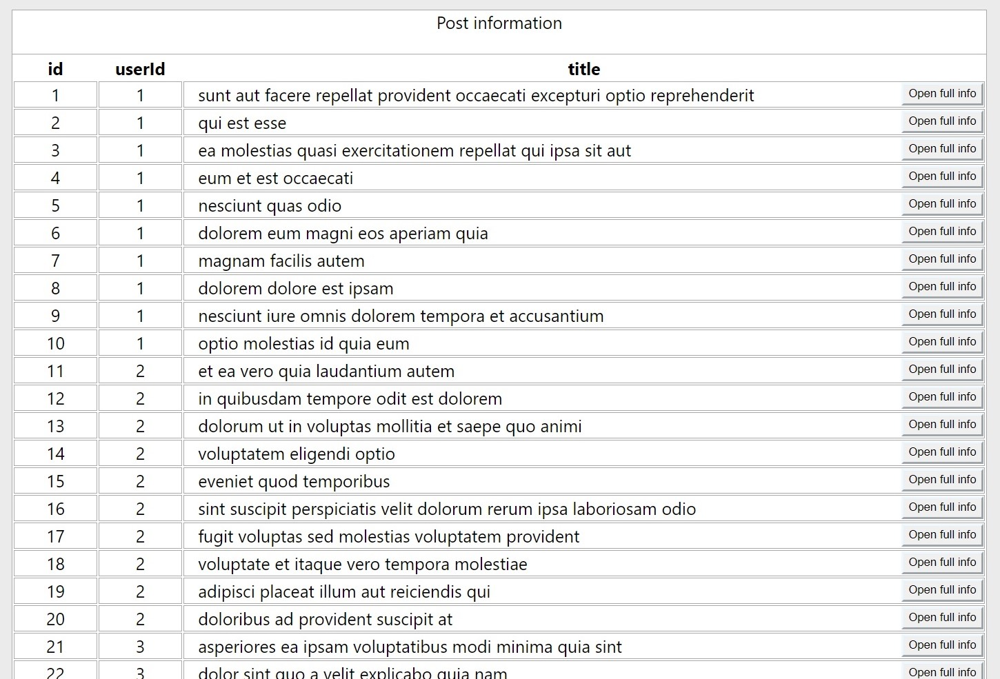
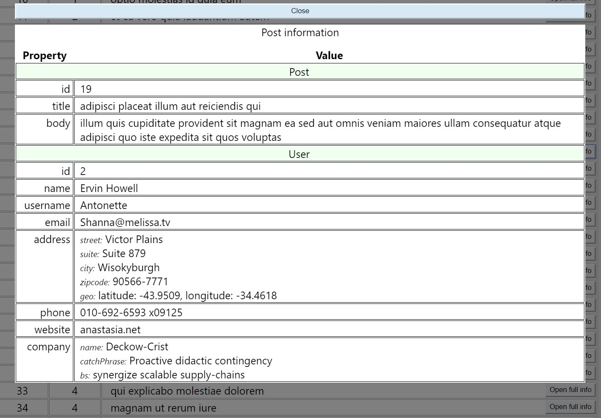

# [JSONPlaceholder-App](https://jsonplaceholder-app.netlify.com/)

Web-site: [JSONPlaceholder-App](https://jsonplaceholder-app.netlify.com/)

The JSONPlaceholder-App application displays post data received from https://jsonplaceholder.typicode.com.
When loading the page you can see the table in which the primary data about the posts is placed. When you click on a table row (post), a modal window opens in which you can see the full information about the selected post. Close the modal window by clicking on the "Close" button.

Post data is received in JSON format when sending a GET request using the "fetch" function before displaying the table. While waiting for a response from the server, the page displays "Loading ...". If the request to the server could not be obtained, the page will display "Sorry, server is not available now". 
After receiving data using the TableRow component, a table with the primary data about the posts is displayed. When you click on any post, a modal window opens, a request is sent to the server for data about the specific user involved in the post. After receiving a response from the server using the PostInfo component, the complete data about the post is displayed in the form of a table. While waiting for data, the screen also displays "Loading ...". 
The application is correctly displayed in the Google Chrome browser.

<picture>

</picture>
